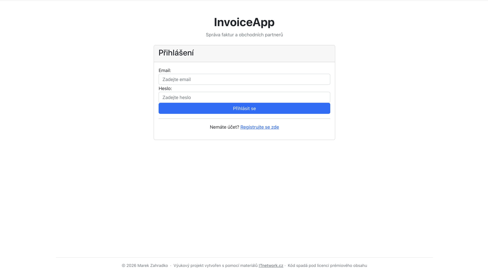
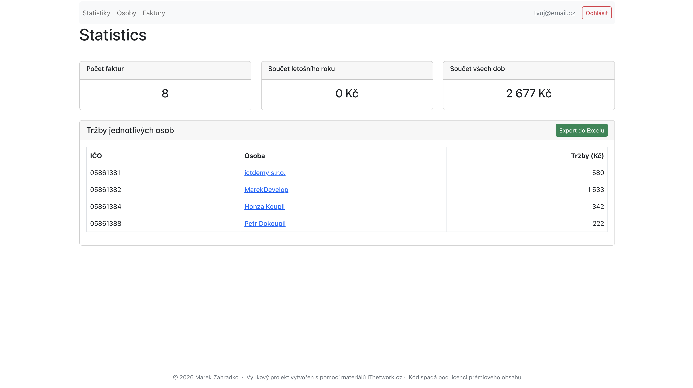
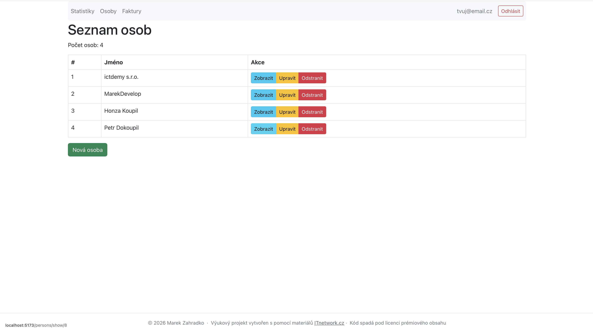
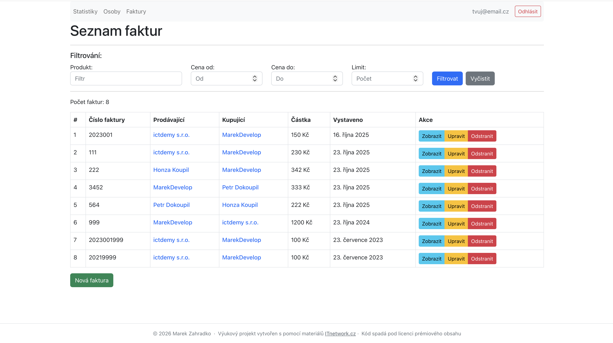
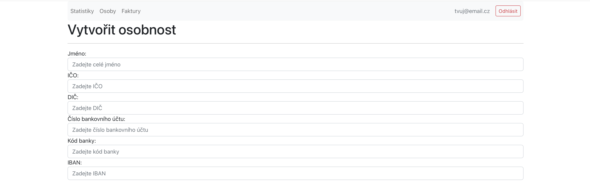
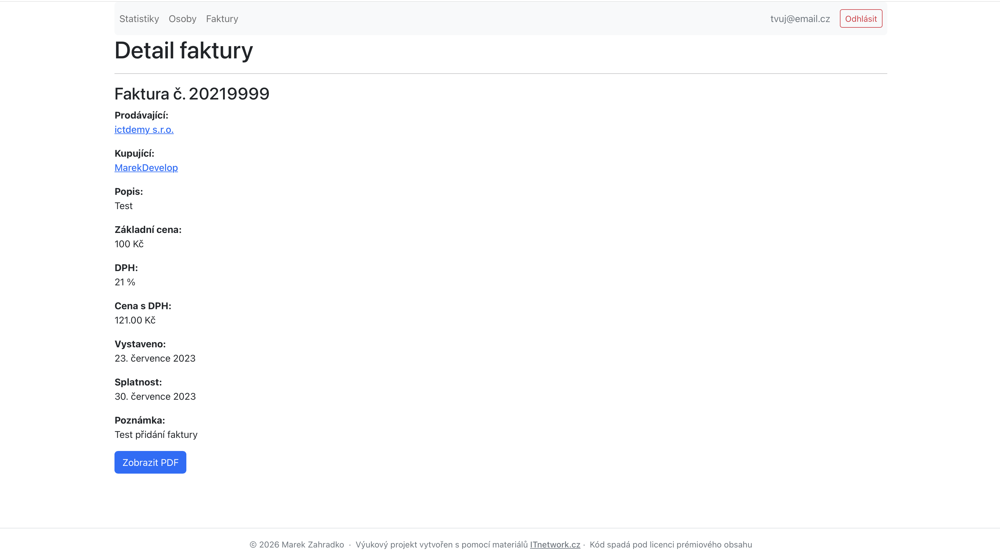

# Invoice Management System

Full-stack web application for managing invoices and persons (clients/vendors).
Built with Spring Boot (backend) and React + TypeScript (frontend).

## Features

- **Invoice management** — create, edit, delete and filter invoices by seller, buyer, product or price range
- **Person management** — manage clients and vendors with soft-delete (invoice history is preserved)
- **ARES integration** — auto-fill company data from the Czech business registry by entering an IČO
- **PDF export** — download any invoice as a formatted PDF document
- **Excel export** — export person revenue statistics as an `.xlsx` file
- **Statistics dashboard** — overview of invoice totals (current year / all time) and per-person revenue
- **JWT authentication** — stateless login with role-based access control (USER / ADMIN)
- **Swagger UI** — interactive API documentation available at `/swagger-ui.html`

## Tech Stack

| Layer | Technology |
|-------|-----------|
| Backend | Java 17, Spring Boot 3, Spring Security, Spring Data JPA |
| Database | MySQL 8, Hibernate (schema auto-update) |
| Mapping | MapStruct, Lombok |
| PDF | Thymeleaf + openhtmltopdf |
| Excel | Apache POI |
| Frontend | React 18, TypeScript, Vite, React Router v6 |
| Styling | Bootstrap 5 |
| Auth | JWT (jjwt) |

## Project Structure

```
├── backend/      # Spring Boot REST API (Java 17, MySQL)
├── frontend/     # React + TypeScript SPA (Vite, React Router)
└── screenshots/  # Application screenshots
```

## Screenshots

| Login | Dashboard |
|-------|-----------|
|  |  |

| Person List | Invoice List |
|-------------|--------------|
|  |  |

| Create Person | Invoice Detail |
|---------------|----------------|
|  |  |

## Documentation

- [Backend README](backend/README.md) — setup, database configuration, API endpoints
- [Frontend README](frontend/README.md) — setup, pages, project structure

## Quick Start

1. Start the backend — see [backend/README.md](backend/README.md)
2. Start the frontend — see [frontend/README.md](frontend/README.md)
